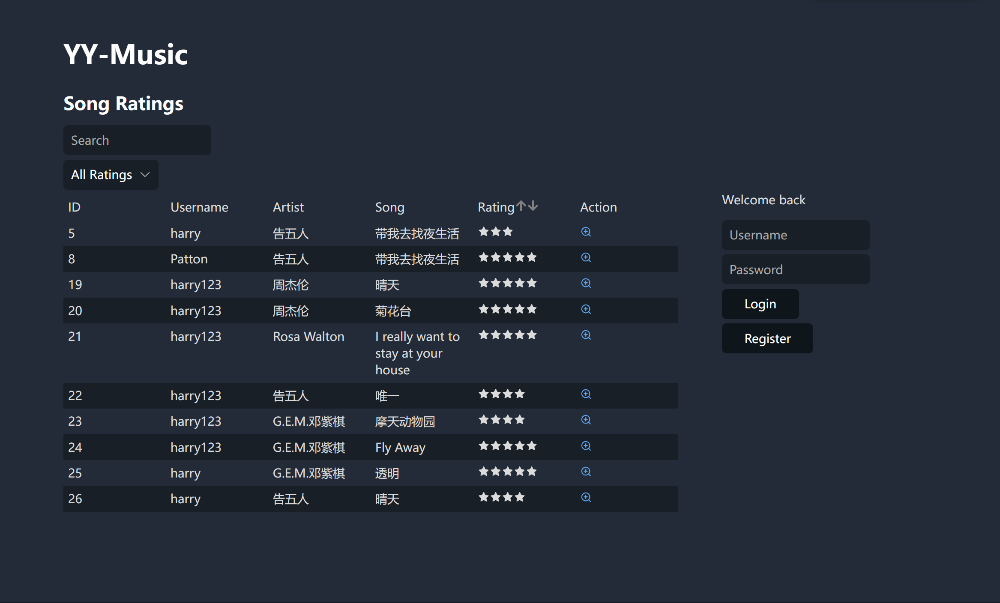
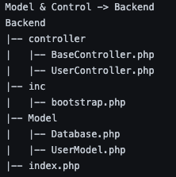
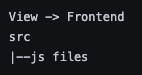

# YY_MUSIC with JS

This repo contains both the frontend and backend of the YY-music site.

This is a music rating landing site that was designed and published as part of the COMP 333 Software Engineering class at Wesleyan University. This is a training exercise.

## To Run this App Locally

### Pre-requisites:

1. Ensure you have **XAMPP** installed for running the backend PHP server.
2. Ensure you have **Node.js** and **npm** installed for running the React front-end.

### Setting Up:

1. Clone this repository into the `htdocs` folder if you're using XAMPP. (Ensure that the repo is in the directory that your local backend server can access.)

2. Navigate to the folder:
3. Use the provided [music_db.sql](https://github.com/PattonYin/YY_Music_JS/blob/main/music_db.sql) to set up your database. We have provided sample tables in this SQL, so you don't have to fill in
   song reviews by yourself.
4. Update npm to its latest version:
   ```bash
   npm install -g npm
   ```

### Installing Dependencies:

1. Install the required dependencies for the app:

   - For routing:
     ```bash
     npm install react-router-dom
     ```
   - For icons:
     ```bash
     npm install react-icons --save
     ```

### Running the Servers:

1. Start the XAMPP server and ensure the PHP backend is running.
2. Start the React front-end server:
   ```bash
   npm start
   ```

Your app should now be running locally! Open your browser and go to `http://localhost:3000` to view the app (unless you've specified a different port).

After setting up all this, you will be able to run our web locally. Here is a screenshot of how it should like:


## Additional functionality added

### The Sort Functionality:

1. By clicking on the Table Title "Rating", the user would be able to sort the song ratings in either ascending or descending order (or default order - sorted by the id of the songs).

### The Search Functionality:

1. The user can select the star levels to look at.
2. The user can search for other users; artists; song names;
3. You can do both 1 and 2 at the same time for a more specific search.

## MVC architecture & REST API

Components Breakdown for Model and Controller:

    index.php:
    Role: Main entry point for our backend.
    Functionality: Receives incoming requests from the frontend. Based on the type of action requested and any associated data, it delegates the responsibility to the UserController for processing.

    BaseController.php:
    Role: Centralized response manager.
    Functionality: Takes output from the UserController, transforms it into a JSON format, and sends it back to the frontend.

    UserController.php:
    Role: Core logic handler.
    Functionality: Interprets commands and raw inputs provided by index.php. It coordinates with UserModel.php to execute queries and then routes the data back through the BaseController.

    bootstrap.php:
    Role: Initialization script.
    Functionality: Contains essential setup code required for the backend to operate.

    Database.php:
    Role: Database configuration manager.
    Functionality: Maintains fundamental details about the database, such as server information, host details, and provides the foundation for initiating database queries.

    UserModel.php:
    Role: Data interaction layer.
    Functionality: Executes database queries under instructions from the UserController, ensuring that data is accurately fetched, stored, updated, or deleted as per the request.



Out code related to the front end are all in the src Folder:



How our app is related to REST:

1. Statelessness
   Our app does not maintain any session information between requests. Each request to the server contains all the information needed.
2. Client-server Decoupling
   Our React frontend communicates with the PHP backend to fetch, display, and update data. The frontend is responsible for presenting data and user interactions, while the server handles data storage and query requests.

## Externel use of Resources

We used the following resources in our project:

CSS Style Sheet - Water CSS Link:
`https://cdn.jsdelivr.net/npm/water.css@2/out/water.css`

## Member Contribution

Harry Yu 50%
Patton Yin 50%
